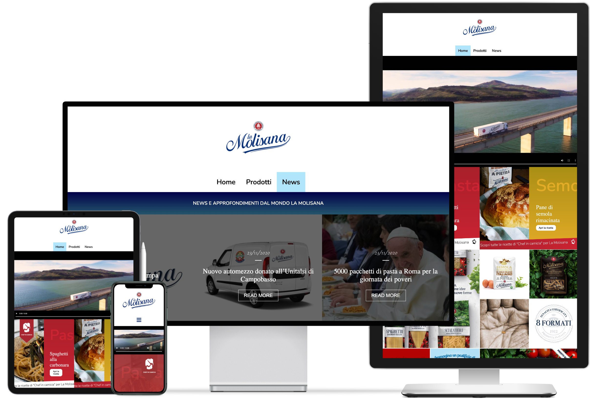

<p align="center">
 
</p>

<h2 align="center">La molisana</h2>

---

<p align="center">Web-Page of La Molisana that shows you pics and descriptions about type of Pastas.</p>
<br> 
    
## ⛏️ Built With <a name = "tech_stack"></a>

-   [HTML](https://html.com) - Page Structure
-   [SCSS](https://sass-lang.com) - Page Style
-   [JavaScript](https://www.javascript.com/) - Front-End Logic
-   [VueJS](https://www.javascript.com/) - Front-End Framework
-   [PHP](https://www.php.net) - Back-End Logic
-   [Laravel Mix](https://laravel-mix.com) - Back-End Package

## ✍️ Authors <a name = "authors"></a>

-   [@IvanDF](https://github.com/IvanDF) - Design & Develop

See also my [website!](https://ivandf.dev)
New one is in progress.

<br />

---

<br />

## How to run

**Run from the root of the project folder**

First install dependencis with **COMPOSER** and **NPM**:

```
$ - composer install

$ - npm i
```

Then create **.env** file and generate **ApiKey**:

```
$ - cp env.example .env

$ - php artisan key:generate
```

At the end run the project:

```
$ - php artisan serve

$ - npm run watch
```
